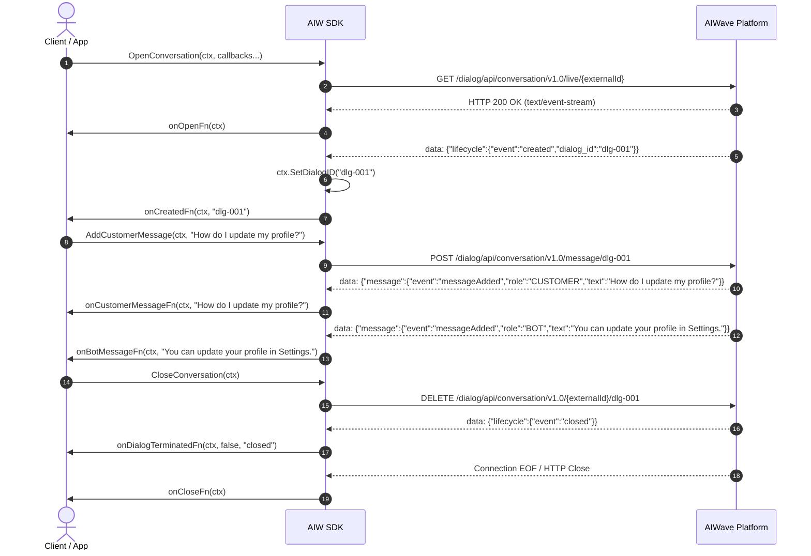
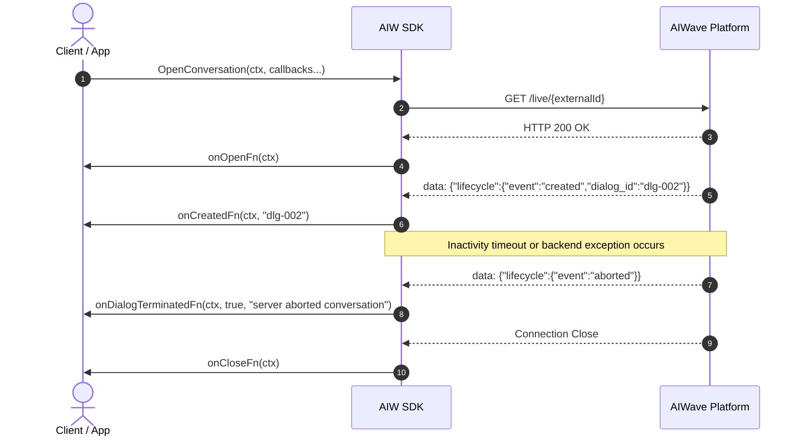
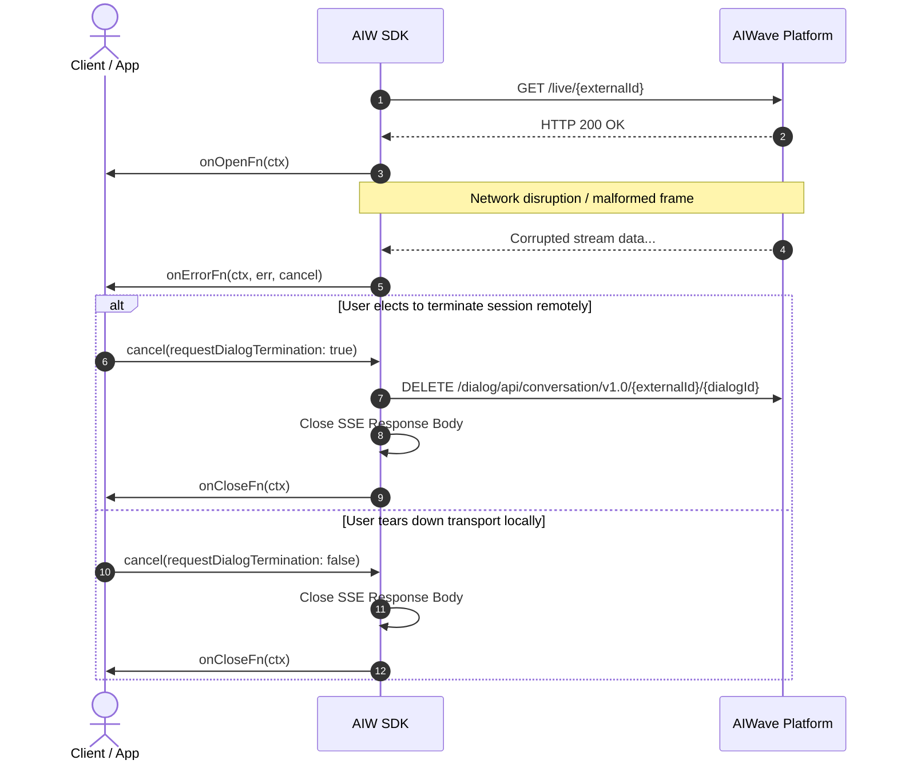

# Conversational Flow & Callback Architecture

This document describes the reactive Server-Sent Events (SSE) streaming architecture, conversational lifecycle flows, and callback execution model implemented in the **AIW Go SDK**.

---

## 1. Overview & Architecture

The conversational engine in the AIW Go SDK manages duplex real-time interactions with the AIWave cognitive platform:
- **Downstream Channel (Server -> Client):** Real-time Server-Sent Events (SSE) stream (`GET /dialog/api/conversation/v1.0/live/{externalId}`).
- **Upstream Channel (Client -> Server):** REST API requests to dispatch messages (`POST /dialog/api/conversation/v1.0/message/{dialogId}`) or terminate sessions (`DELETE /dialog/api/conversation/v1.0/{externalId}/{dialogId}`).

To provide granular control, deterministic state transitions, and clean resource management, `ConversationalService.OpenConversation` exposes **seven distinct callbacks**:

```text
                                  ┌───────────────────────────┐
                                  │         onOpenFn          │ (SSE Transport Established, HTTP 200)
                                  └─────────────┬─────────────┘
                                                │
                                                ▼
                                  ┌───────────────────────────┐
                                  │        onCreatedFn        │ (Server assigns DialogID: "created")
                                  └─────────────┬─────────────┘
                                                │
                    ┌───────────────────────────┴───────────────────────────┐
                    ▼                                                       ▼
         ┌───────────────────────┐                               ┌───────────────────────┐
         │  onCustomerMessageFn  │                               │    onBotMessageFn     │
         │   ("messageAdded",    │                               │   ("messageAdded",    │
         │    role: CUSTOMER)    │                               │   role: BOT / AGENT)  │
         └───────────────────────┘                               └───────────────────────┘
                    │                                                       │
                    └───────────────────────────┬───────────────────────────┘
                                                │
                                                ▼
                                  ┌───────────────────────────┐
                                  │   onDialogTerminatedFn    │ (Lifecycle ends: "closed" / "aborted")
                                  └─────────────┬─────────────┘
                                                │
                                                ▼
                                  ┌───────────────────────────┐
                                  │         onCloseFn         │ (SSE Transport Stream EOF / Terminated)
                                  └───────────────────────────┘

                  ┌───────────────────────────────────────────────────────────┐
                  │                         onErrorFn                         │
                  │   (Infrastructural / Functional Errors + Cancel Control)  │
                  └───────────────────────────────────────────────────────────┘
```

---

## 2. Callback Reference & Specifications

### Summary Table

| Callback | Signature | Trigger Phase | `ConversationalContext` State |
|---|---|---|---|
| **`onOpenFn`** | `func(ctx ConversationalContext) error` | HTTP `200 OK` received; SSE connection opened. | `ExternalID` valid; `DialogID` is **empty**. |
| **`onCreatedFn`** | `func(ctx ConversationalContext, dialogID string) error` | `lifecycle.event == "created"` received from server. | `DialogID` is **populated** and active. |
| **`onErrorFn`** | `func(ctx ConversationalContext, err error, cancel CancelStreamFunc)` | Transport errors, parsing failures, domain errors. | Context accessible; provides `cancel` handle. |
| **`onCustomerMessageFn`** | `func(ctx ConversationalContext, mex string) error` | `message.event == "messageAdded"` with role `CUSTOMER`. | `DialogID` active; message acknowledged. |
| **`onBotMessageFn`** | `func(ctx ConversationalContext, mex string) error` | `message.event == "messageAdded"` with role `BOT`/`AGENT`. | `DialogID` active; AI reply received. |
| **`onDialogTerminatedFn`** | `func(ctx ConversationalContext, isAborted bool, reason string) error` | `lifecycle.event == "aborted"` or `"closed"`. | Dialog lifecycle finished on backend. |
| **`onCloseFn`** | `func(ctx ConversationalContext) error` | SSE connection terminated; reader goroutine exits. | Terminal state; cleanup guaranteed via `sync.Once`. |

---

### Callback Details

#### 1. `OnOpenFn`
```go
type OnOpenFn func(ctx ConversationalContext) error
```
- **When Called:** Immediately after the HTTP response status `200 OK` is verified with `Content-Type: text/event-stream`.
- **Purpose:** Inform the application that the network transport is connected.
- **Note:** Do not dispatch messages inside `onOpenFn` as the backend has not yet provisioned the `DialogID`. Wait for `onCreatedFn`.

#### 2. `OnCreatedFn`
```go
type OnCreatedFn func(ctx ConversationalContext, dialogID string) error
```
- **When Called:** When the server emits `{"lifecycle": {"event": "created", "dialog_id": "<id>"}}`.
- **Purpose:** Signals that the session aggregate is initialized and ready for bidirectional communication.
- **Best Practice:** Unlock chat input UI or begin sending queued messages (`convService.AddCustomerMessage`).

#### 3. `OnErrorFn` & `CancelStreamFunc`
```go
type CancelStreamFunc func(requestDialogTermination bool)

type OnErrorFn func(ctx ConversationalContext, err error, cancel CancelStreamFunc)
```
- **When Called:** On network drops, timeouts, malformed SSE payloads, callback errors, or backend rejections.
- **Active Cancellation Control (`CancelStreamFunc`):**
  - `cancel(false)`: Immediately tears down the local SSE stream without making remote network calls (ideal for connection breaks or offline scenarios).
  - `cancel(true)`: Tears down the local SSE stream **and** sends an asynchronous `DELETE` request to release backend GPU/agent resources.

#### 4. `OnCustomerMessageFn`
```go
type OnCustomerMessageFn func(ctx ConversationalContext, mex string) error
```
- **When Called:** When the server acknowledges that a customer message has been accepted and added to the dialog history.

#### 5. `OnBotMessageFn`
```go
type OnBotMessageFn func(ctx ConversationalContext, mex string) error
```
- **When Called:** When an AI response or human agent reply is streamed.
- **Payload:** Raw text or structured JSON containing answers and supporting citations (`sources`).

#### 6. `OnDialogTerminatedFn`
```go
type OnDialogTerminatedFn func(ctx ConversationalContext, isAborted bool, reason string) error
```
- **When Called:** When the conversational dialog lifecycle ends on the server.
  - `isAborted == true`: Server aborted the dialog (inactivity timeout, policy violation, server exception).
  - `isAborted == false`: Dialog was closed cleanly (e.g. following client close request or conversational completion).

#### 7. `OnCloseFn`
```go
type OnCloseFn func(ctx ConversationalContext) error
```
- **When Called:** When the SSE transport stream ends and local resources are released.
- **Guarantee:** Idempotently executed exactly once via `sync.Once`.

---

## 3. Conversational Sequence Diagrams

### 3.1. Standard Interactive Chat Lifecycle



---

### 3.2. Server Inactivity Timeout / Abort Flow



---

### 3.3. Error Recovery & Cancellation Flow



---

## 4. Complete Code Example

```go
package main

import (
	"context"
	"fmt"
	"time"

	"github.com/morphy76/aiw-client/pkg/aiw"
)

func main() {
	client, err := aiw.New(
		aiw.WithBaseURL("https://portal.aiwave.ai"),
		aiw.WithTimeout(30*time.Second),
	)
	if err != nil {
		panic(err)
	}
	defer client.Close()

	convService := client.Conversational()

	ctx, cancel := context.WithTimeout(context.Background(), 60*time.Second)
	defer cancel()

	convCtx, err := aiw.NewConversationalContextBuilder().
		WithContext(ctx).
		WithExternalID("user-123-Rocchetto").
		WithDialogModel("Rocchetto").
		WithBearerToken("your-pat-token").
		Build()
	if err != nil {
		panic(err)
	}

	err = convService.OpenConversation(
		convCtx,
		// 1. onOpenFn: Transport connected
		func(c aiw.ConversationalContext) error {
			fmt.Println("🔗 SSE transport stream connected.")
			return nil
		},
		// 2. onCreatedFn: Dialog ready
		func(c aiw.ConversationalContext, dialogID string) error {
			fmt.Printf("🚀 Dialog created! Assigned Dialog ID: %s\n", dialogID)
			return convService.AddCustomerMessage(c, "Hello AI!")
		},
		// 3. onErrorFn: Error handling with cancel handle
		func(c aiw.ConversationalContext, err error, cancel aiw.CancelStreamFunc) {
			fmt.Printf("❌ Error: %v\n", err)
			cancel(true) // Clean up remote dialog on error
		},
		// 4. onCustomerMessageFn: Customer echo
		func(c aiw.ConversationalContext, mex string) error {
			fmt.Printf("👤 Customer message acknowledged: %s\n", mex)
			return nil
		},
		// 5. onBotMessageFn: Bot reply
		func(c aiw.ConversationalContext, mex string) error {
			fmt.Printf("🤖 Bot response: %s\n", mex)
			return convService.CloseConversation(c)
		},
		// 6. onDialogTerminatedFn: Dialog termination
		func(c aiw.ConversationalContext, isAborted bool, reason string) error {
			if isAborted {
				fmt.Printf("⚠️ Dialog ABORTED by server: %s\n", reason)
			} else {
				fmt.Printf("ℹ️ Dialog CLOSED cleanly: %s\n", reason)
			}
			return nil
		},
		// 7. onCloseFn: Teardown complete
		func(c aiw.ConversationalContext) error {
			fmt.Println("🔌 SSE stream closed. Cleanup complete.")
			return nil
		},
	)

	if err != nil {
		panic(err)
	}
}
```
